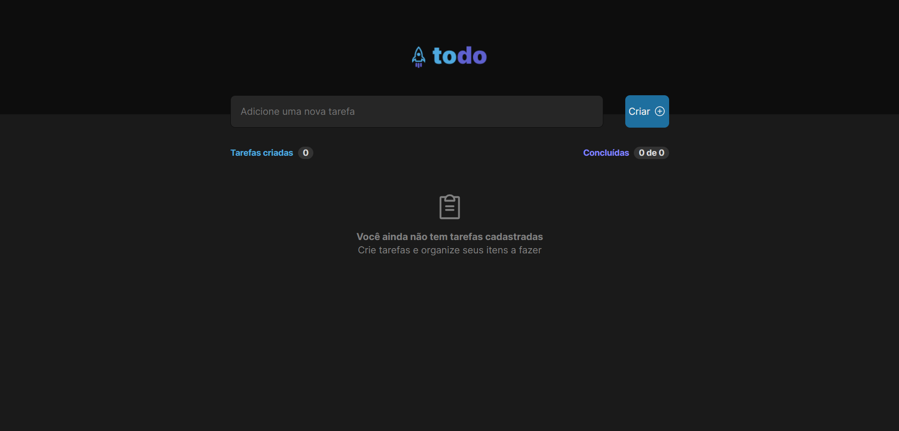

# todo-list-ignite-challenge

Projeto referente ao Desafio 01 (Praticando conceitos do ReactJS) do bootcamp [Ignite](https://lp.rocketseat.com.br/ignite). O layout da aplicação foi construído a partir do design fornecido pelo Figma.
 
O projeto consiste na criação de uma aplicação com lista de tarefas (To do lis) para gerenciar as atividades do usuário. Uma funcionalidade adicionada foi a de filtrar as atividades do usuário por todas que foram criadas, ativas e finalizadas, como padrão todas as atividades criadas são apresentadas na tela inicial.

## Construção

O layout do projeto foi criado a partir do design fornecido pelo Figma. As estilizações foram feitas com CSS modules, o checkbox foi importado de uma biblioteca de UI components para facilitar a estilização.
 
Todo o projeto está responsivo, portando é compatível com as principais telas de dispositivos.

## Recursos utilizados

- Criação do projeto com [Vite](https://vitejs.dev/);
- Biblioteca de ícones [Phosphor Icons](https://phosphoricons.com/);
- UI components library [Radix](https://phosphoricons.com/), para estilização do checkbox.

## Deploy do projeto

[ToDo List App](https://todo-list-ignite-challenge.vercel.app/)
 
Caso prefira abrir a aplicação pelo localhost basta digitar no console `npm run dev`.

## Design da aplicação

 

## Aprendizado

A construção deste projeto permitiu praticar os principais conceitos do React como estados, imutabilidade, componentização e propriedades. Além disso colocar em prática métodos de manipulação de arrays como `filter` e `map`.

### Melhorias a serem implementadas

Posteriormente será implementada a função de salvar as tarefas criadas no localStorage ou em um banco de dados para que os dados tornem-se persistentes ao atualizar a página da aplicação.

## Dados complementares

- Autor: [Yasmin](https://www.linkedin.com/in/yasmin-goncalves/)
- Challenge by: [Rocketseat](https://www.rocketseat.com.br/)
 
